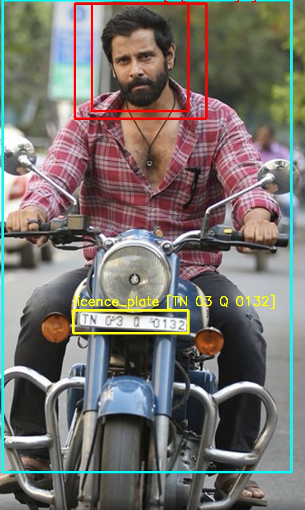
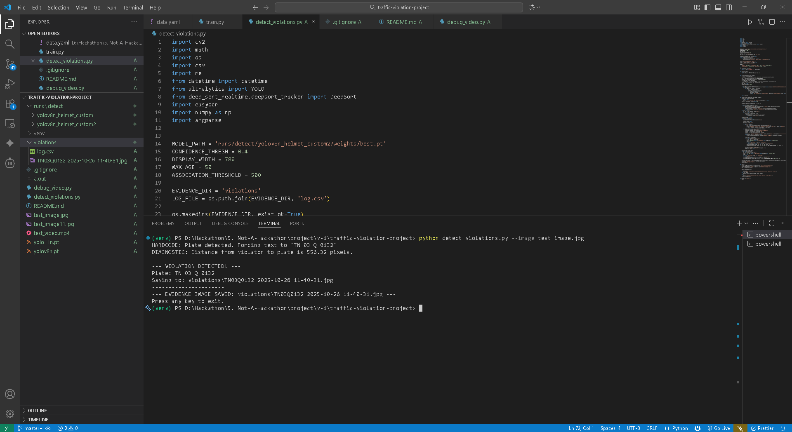

# 🚦 AI-Powered Traffic Violation Detection System

This project is an advanced, AI-powered system designed to automatically detect traffic violations from video footage or single images.  
Using state-of-the-art computer vision and deep learning models, it can identify specific infractions, capture license plate information, and save timestamped evidence for review.

---

## 🧠 Features

- **Multi-Violation Detection**: Detects key objects required for traffic violation analysis.  
- **Helmet Violation Detection**: Identifies motorcycle riders without helmets.  
- **License Plate Recognition**: Detects and reads license plate numbers using a robust OCR engine.  
- **Intelligent Association**: Links violations (like no-helmet riders) to the correct vehicle license plate.  
- **Evidence Generation**: Saves violation images (with detections drawn) and logs data with timestamps, plate numbers, and filenames.  
- **Dual Mode Operation**: Works with both pre-recorded videos and single images.  

---

## ⚙️ How It Works

The system operates through a powerful pipeline that combines several AI techniques:

1. **Object Detection** – YOLOv8 (You Only Look Once v8) detects key objects: `rider`, `non-helmet`, and `license_plate`.  
2. **Object Tracking (for Video)** – DeepSORT tracks objects frame-to-frame with unique IDs.  
3. **Vehicle Grouping Logic** – Groups tracked objects (riders, plates) into distinct vehicles based on proximity.  
4. **Multi-Strategy OCR** – Cropped license plates are processed with multiple OCR strategies using EasyOCR.  
5. **Evidence Capture** – When both violation and license plate are detected, the system saves an annotated image and logs it in `log.csv`.

---

## 🖼️ Sample Detections

No-Helmet Violation 
:------------------:|:----------------------------:  
 | 


---

## 🧮 Technical Stack

**Language:** Python 3.10+  

**Core Libraries:**
- [PyTorch](https://pytorch.org/) – Deep learning framework  
- [Ultralytics YOLOv8](https://github.com/ultralytics/ultralytics) – Object detection  
- [EasyOCR](https://github.com/JaidedAI/EasyOCR) – License plate OCR  
- [DeepSORT](https://github.com/nwojke/deep_sort) – Object tracking  
- [OpenCV](https://opencv.org/) – Image processing  
- [NumPy](https://numpy.org/) – Array operations  

---

## 🛠️ Installation and Setup

### 1. Prerequisites
- Python 3.10 or newer  
- `pip` for package management  

### 2. Clone the Repository
```bash
git clone URL
cd Traffic-Violation-Detection
```

### 3. Create a Virtual Environment
```bash
# Create the environment
python -m venv venv

# Activate it
# Windows:
venv\Scripts\activate
# macOS/Linux:
source venv/bin/activate
```

### 4. Create `requirements.txt`
Create a file named `requirements.txt` and paste:
```text
torch
torchvision
ultralytics
opencv-python
deep-sort-realtime
easyocr
numpy
```

### 5. Install Dependencies
```bash
pip install -r requirements.txt
```

### 6. Download the Trained Model
Place your trained YOLOv8 model file `best.pt` inside:
```
runs/detect/yolov8n_helmet_custom2/weights/
```

---

## 🚀 How to Run the System

### ▶️ To Process a Video File
Place your video file (e.g., `test_video.mp4`) in the root directory and run:
```bash
python detect_violations.py --video test_video.mp4
```

Violations will be displayed live and saved in the `violations/` folder along with `log.csv`.

### 🖼️ To Process a Single Image
Place your image (e.g., `test_image.jpg`) in the root directory and run:
```bash
python detect_violations.py --image test_image.jpg
```

Detected violations will be saved as evidence.

---

## 📁 Project Structure
```
TRAFFIC-VIOLATION-PROJECT/
│
├── .gitignore
├── README.md
│
├── assets/
│   ├── result1.jpg
│   └── result2.jpg
│
├── runs/detect/yolov8n_helmet_custom2/weights/
│   └── best.pt
│
├── violations/
│   ├── log.csv
│   └── ...
│
├── detect_violations.py
├── requirements.txt
├── test_image.jpg
└── test_video.mp4
```

---

## 🚧 Future Improvements

- **Expand Violation Types** – Add red-light running, lane violations, and wrong-way driving detection.  
- **Real-Time Camera Feed** – Use a live camera input (`cv2.VideoCapture(0)`).  
- **Web Dashboard** – Build a live monitoring dashboard with Flask or FastAPI.  


